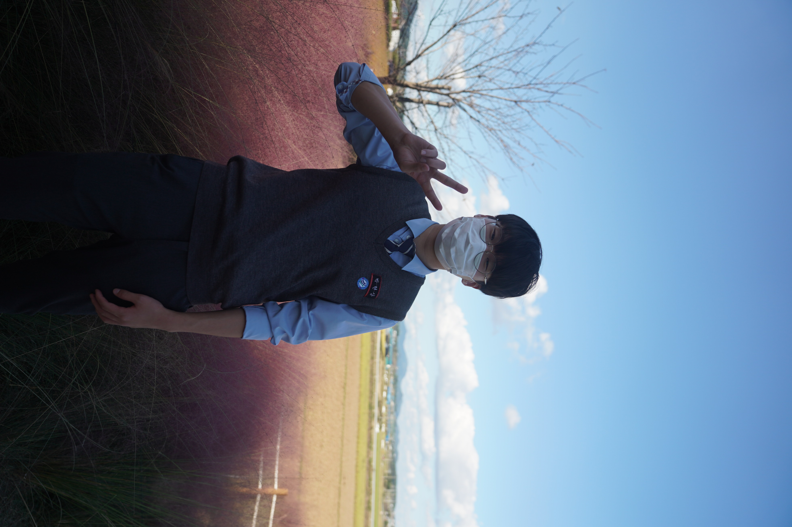

## About Me

  

    
  

  

    

      <h3>It's Me!</h3>
    

    

      
안녕하세요, 박현상입니다. 영어 닉네임으로는 Aaron Park 입니다. 
      주로 Golang을 이용한 미디어 스토리지, 인프라 개발과 운영을 하고 있습니다. 
      다양한 분들과 함께 이야기 하는 것을 좋아합니다.  
      저와 함께 이야기 하고 싶으신 분들은 아래 메일로 연락 주시면 감사하겠습니다!
      

      <li><a herf="mailto:parkhyunsang@kakao.com" style="font-size:16px">parkhyunsang@kakao.com</a></li>
      <li><a herf="mailto:hyun.sang@teamgrit.kr" style="font-size:16px">hyun.sang@teamgrit.kr</a></li>
    

  

## Experience
- **[TeamGRIT, Inc.](https://teamgrit.kr) Software Engineer & Researcher** - 2021.08.09 ~ Current
  - Media Storage Software Development at Go
  - Infrastructure at AWS

