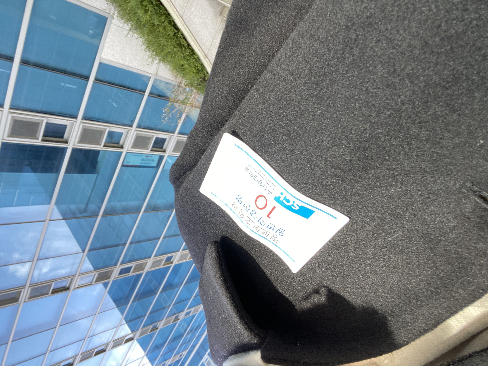
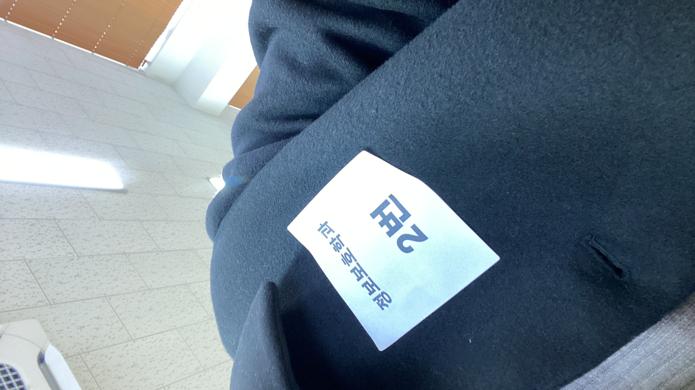
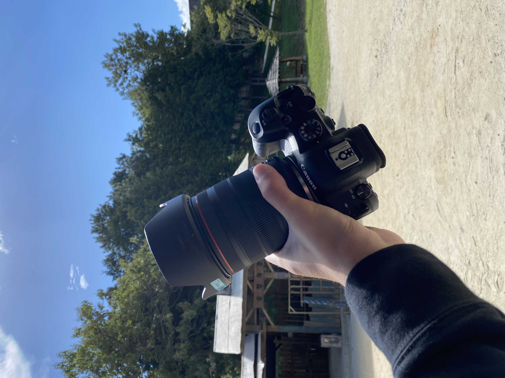
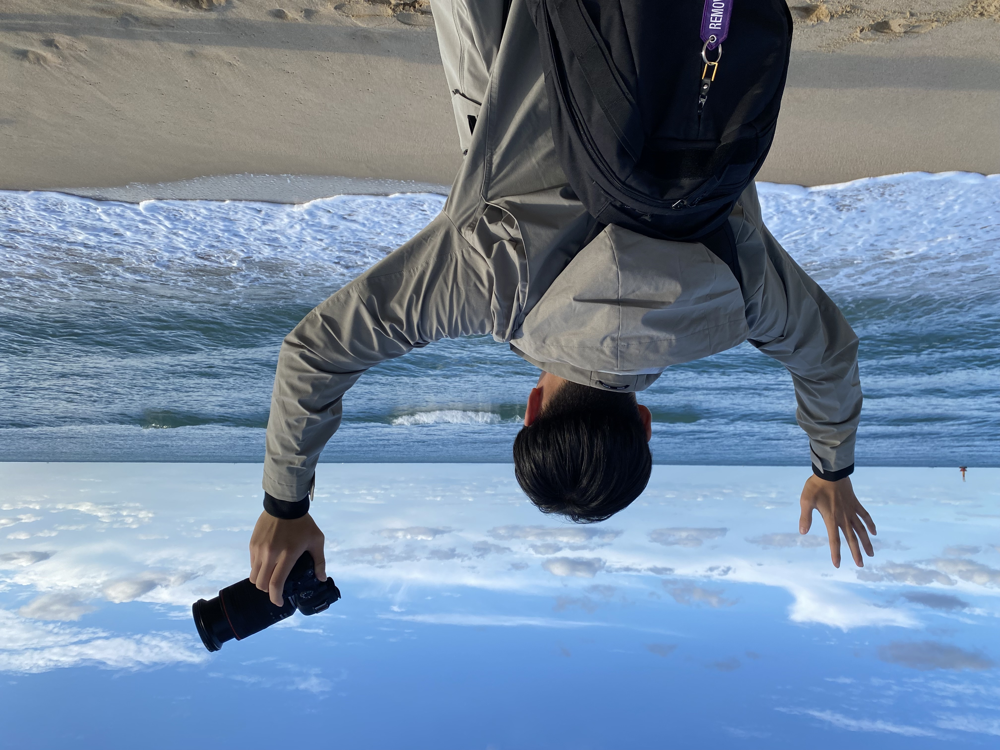
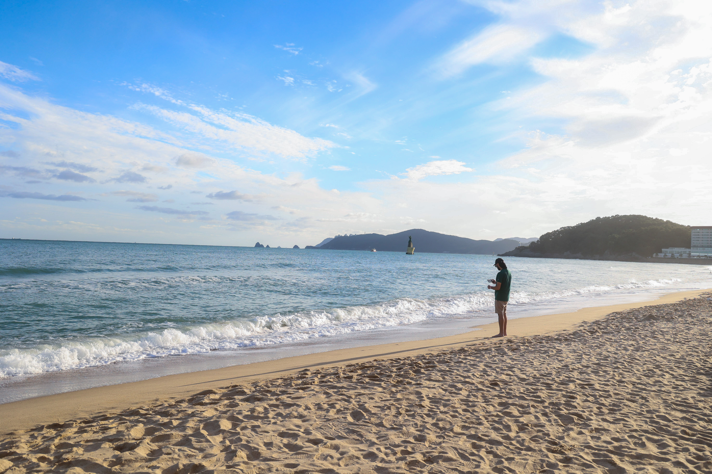
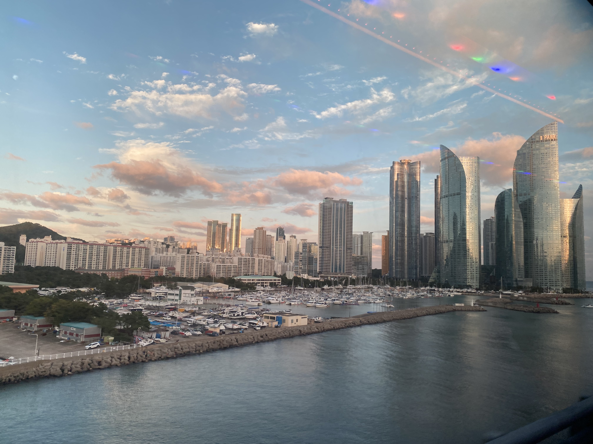
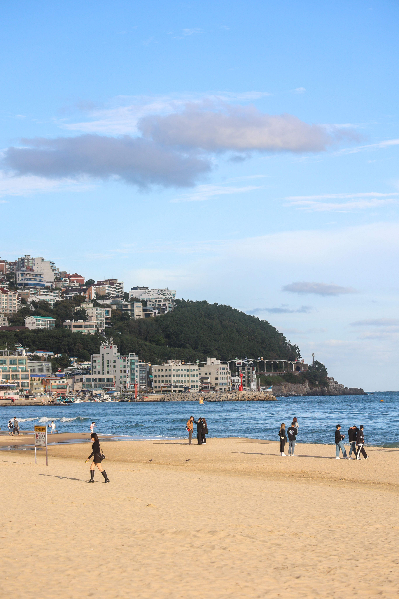
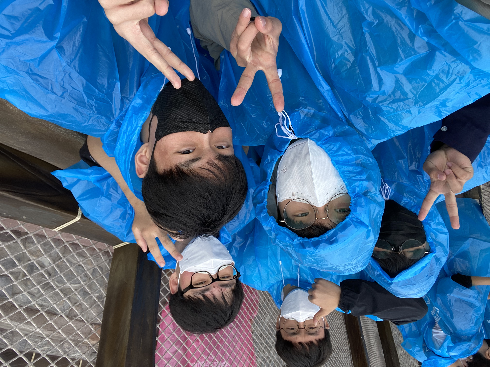

안녕하세요. 박현상입니다.  
2022년 연말인 요즘, 저를 돌아보고 반성하고 발전하고 싶은 점들이 있는지 돌아보기 위해 회고를 작성합니다.   
또한 부적한 부분을 찾고 2023년 더 발전된 모습을 만들기 위해 노력합니다.
아래 명언 저는 항상 생각하면서 살고 있습니다 :)

> ***”모든 것의 시작은 위험하다. 그러나 무엇을 막론하고,  
> 시작하지 않으면 아무것도 시작되지 않는다.“***  
> **프리드리히 니체의 "인간적인 너무나 인간적인"에서**  

## 🏫 고등학교 3학년, 대학 입시
저는 현재 고등학교 3학년이며, 대학교에 가기 위해서 입시를 준비하게 되었습니다.  
서울권 대학 3개와 경기권 대학 1개, 충남권 대학 1개, 전남권 대학 1개를 준비하여 총 6개의 대학에 입시 원서를 냈습니다.  
서울권 대학 2곳은 소프트웨어 특기자 전형으로 원서를 냈지만 서울권과 경기권은 1차에서 떨어져서 불안 했었는데 충남권과 전남권 대학은 다행히도 1차 붙어서 면접을 보게 되었습니다. 면접을 보면서 생각보다 어렵지 않은 질문이어서 다행이었습니다. 저는 생각보다 막 긴장을 하는 사람이 아닌지라 긴장하지 않고 편안하게 교수님들께서 하시는 질문을 잘 듣고 잘 말씀 드린 것 같아서 좋은 결과가 있으면 좋겠습니다.





## 📸 취미생활, 사진 찍기
참고로 저는 학교에서 영상을 전공하고 있는 특성화고 학생입니다.  
제가 가지고 있는 생각은 "다양한 것들을 배우고 경험해 보자"입니다. 중학교 때 우연히 영상에 대해서 깊게 배우고 싶다라는 생각을 하게 되었고 영상에 대해서 배우던 도중 사진에 대해서 큰 흥미를 가지게 되었습니다.  
"우리가 기억 속에 모든 것들을 기록할 수 없는 것 같다"라는 생각이 들어서 
열심히 찍던 도중 올해 서울시에서 주최한 제 16회 빛공해 사진 공모전 수상에서 장려상을 수상하였습니다. 비록 제가 사진을 찍으면서 처음으로 받아본 상이라서 더 이상 깊고 좋았습니다 :)  
올해 찍은 사진을 외장하드에 저장해 두었는데 외장하드가 고장나서 복구업처에 보냈는데 이미 살릴 수 없다고 해서 2022년 1월 ~ 10월까지 찍었던 사진이 날라갔습니다...🥲  
제가 찍고 있는 사진이 궁금하시면 제 인스타그램([@park.hyunsang](https://instagram.com/park.hyunsang))으로 놀러오세요! 




## 🚌 학교에서의 수학여행
작년보다는 코로나19 상태가 좋아져서 다행히도 친구들과 많은 활동을 할 수 있어서 좋았습니다.  
수학여행 비슷하게 부산을 2박 3일 동안 다녀왔습니다. 부산 롯데월드랑 광안리에 갈 수 있어서 좋았습니다 :)  
내년 봄에 기회가 되면 한 번 가보고자 합니다.











## 🧑🏻‍💻 팀그릿에서의 다양한 경험들
2020년 08월 09일부터 팀그릿에서 소프트웨어 엔지니어로써 다양한 경험들을 하고 있습니다.  
[1년 동안 스타트업에서 경험](/1-year-of-startup-experience)에서 1년 동안을 무엇을 하였는지에 대해서 서술해 보았습니다.  

저는 제가 좋아하는 언어인 Go언어를 통해서 미디어와 관련 솔루션을 개발하였습니다.  
회사에서 개발한 실시간 미디어 솔루션을 통해서 사용자가 중계한 영상을 저장하고 가공하였습니다.  
AWS S3 영상을 저장하고 저장된 영상이 이제 사용자가 요청하면 HLS(HTTP Live Streaming)로 변환(변환은 FFmpeg를 사용)하여 AWS S3 저장합니다. 영상을 처리하며 발생한 정보는 MySQL 혹은 SQLite에 저장되어 제공됩니다. AWS S3는 AWS CloudFront에 연결되어 있어 CDN(Content Delivery Network)로 영상을 조금 더 좋은 방식으로 공유할 수 있도록 하였습니다. 제가 프로젝트 했던 경험을 GDG Golang Korea Golang 1.18 Release Party에서 [Go와 FFmpeg를 이용할 영상 처리 그리고 AWS S3 활용하기](https://youtu.be/W-VWcP_vnZ4)라는 주제로 발표하였습니다.  

위와 같은 개발 경험을 통해서 성장하게 되었으며, 생각보다 재밌었고 흥미가 있는 프로젝트입니다.  
현재는 Rust로 실시간 미디어 중계 솔루션을 대표님과 함께 내년 초부터 개발할 예정입니다. Rust를 공부하고 있는데 조금 어렵다고 생각이 들어서 시간을 많이 들여서 공부할 예정입니다.  

## 📚 한 해 동안 보는 책들
저는 2022년 동안 많은 책들을 읽어보고자 노력했지만 많이 못 읽은 것 같지만 제가 읽었던 책들을 소개드리고자 합니다.  

### 이어령의 마지막 수업
이어령 선생님께서 작고하시기 김지수 작가님(조선일보 디지털 편집국 문화 부장)께서 이어령 선생님께서 가지고 있던 가치관 등 다양한 이야기 등에 대해서 이어령 선생님이 말하는 다양한 이야기들에 대해서 알게 되었습니다.  
20~30대들이 어떻게 살아가야할지, 죽음은 무엇인지 등 우리가 살아가면서 한 번쯤은 고민했던 내용들이 책 내용 속에 있어서 인문학에 관심이 있던 저로썬 큰 흥미를 가지고 읽게 되었습니다.  

이어령 선생님께서 작고하시기 전에 남기신 인문학과 관련된 제가 추천하는 영상들도 있으니 한 번 봐 보시길 추천드려요!  

- ["늙어서 깨달으면 큰일나! 젊은이는 늙고 늙은이는 죽어요"](https://youtu.be/Q2BHEQpZAMs)
- [[이어령의 100년 서재] '하늘을 우러러 한 점 부끄럼이 없기를' 예부터 그려온 하늘의 시선으로 내다보는 대한민국의 새로운 미래.](https://youtu.be/OT4VGrLSUVE)
- [[GMC풀강연] 언어의 힘으로 내일을 바꿀 수 있는가 1부 - 이어령 교수](https://youtu.be/9LcPhl9wDsA)
- [[GMC강연] 발에서부터 시작하는 존재의 의미 - 이어령 교수](https://youtu.be/nnOfD8Gm1oU)

### 니체 너의 운명을 사랑하라
'차라투스트라는 이렇게 말했다'를 읽기 전에 니체에 대해서 알고 있어서 읽게 되었습니다.  
니체는 어린 시절에 아버지를 떠나보내며 삶의 기울림을 알게 되었습니다.  
니체의 삶에 대해서 알게 되었으며, 니체가 무슨 생각을 하면서 살았는지와 19세기 당시에 왜 유명한 철학자가 되었는지 알게 해주는 책입니다. 니체와 관련된 책을 읽기 전에 니체가 어떤 인생을 살았고 니체가 쓴 책 중에 일부분 발췌하여서 소개해 주는 책입니다.  

### 차라투스트라는 이렇게 말했다
전 세계적으로 유명한 프리드리히 니체의 "차라투스트라는 이렇게 말했다"를 읽게 되었습니다.  
니체의 책 중에서 가장 어려운 책이라고 불렸는데 왜 가장 어려운지 알게 되었습니다.  
제가 생각하기로는 니체의 책 중에서는 가장 어려운 책이라 생각이 듭니다.  
니체가 작성하는 책들 중에서 가장 마지막 읽으라고 권하는 책입니다.  
저도 아직까지 다 읽지 못 하였습니다. 2023년에는 꼭 다 읽어보도록 하겠습니다.  

> ***"사랑하는 자는 경멸하기 때문에 창조하려고 한다! 자신이 사랑한 것을 경멸할 줄 모르는 자가 사랑을 알겠는가!  
> 나의 형제여, 그대의 사랑, 그대의 창조와 함께 그대의 고독 속으로 들어가라. 그러면 나중에 가서 정의가 다리를 절며 그대를 뒤따라올 것이다.  
> 나의 형제여, 그대의 눈물과 함께 고독 속으로 들어가라. 나는 자기 자신을 넘어 창조하려고 파멸하는 자를 사랑한다.  
> 차라투스트라는 이렇게 말했다."***  
> **'창조자의 길' 중**

- [니체『차라투스트라는 이렇게 말했다』1부_읽기와 쓰기](https://brunch.co.kr/@csm-93/126)
- [인생에 한번은 《차라투스트라는 이렇게 말했다》 읽기가 목표인 사람들에게, 이진우 교수에게 듣는 니체의 차라투스트라](https://youtu.be/NXdg2glcSXg)
- [니체 : 차라투스트라는 이렇게 말했다(feat. 신의 죽음, 힘에의 의지, 영원회귀, 위버멘쉬)](https://youtu.be/gV6SC0MH9U8)

---

- 2022.11.25 - 초안 작성함. 추후 계속 업데이트 예정.
- 2022.11.29 - 1차 수정, 초안 수정.
- 2022.12.02 - 2차 수정, 읽었던 책들 추가함.

```toc

```