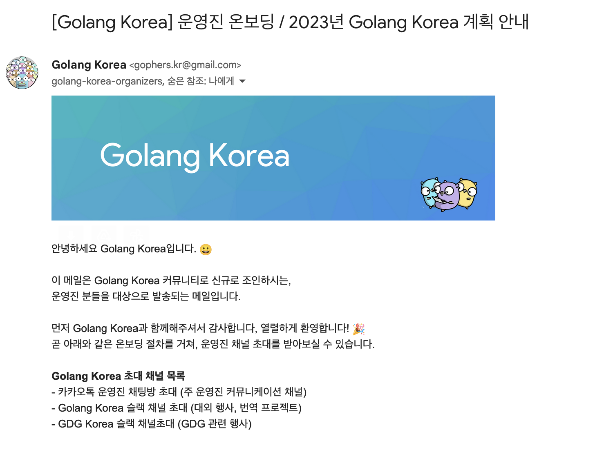
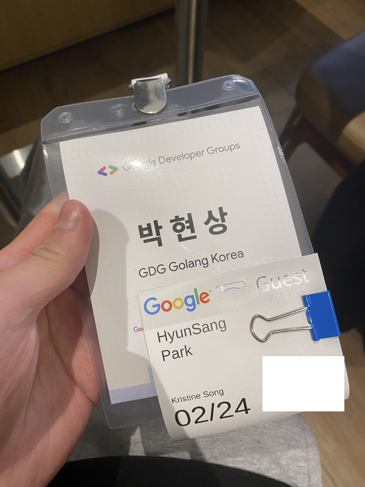
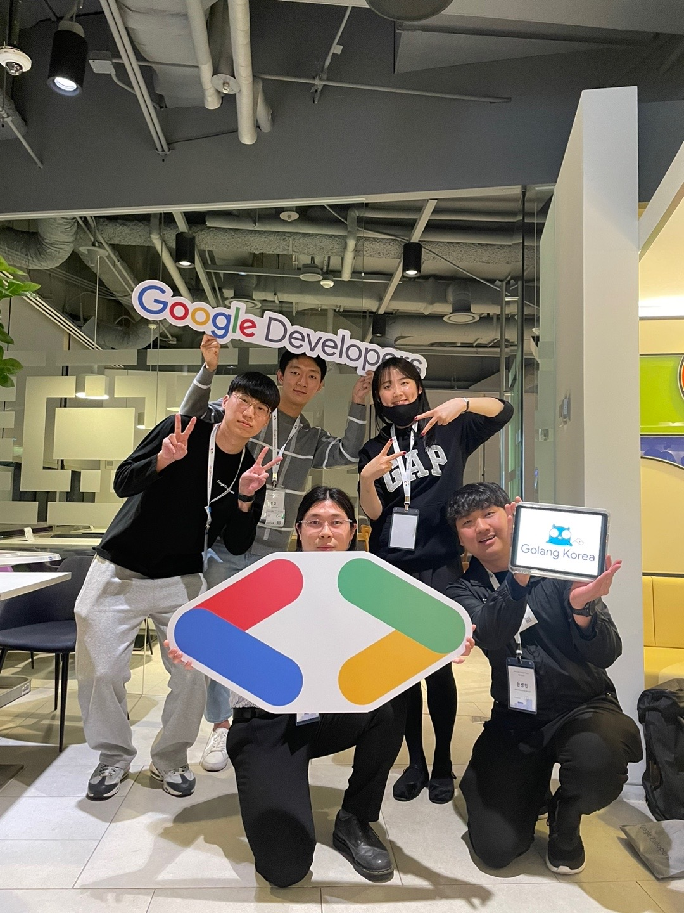
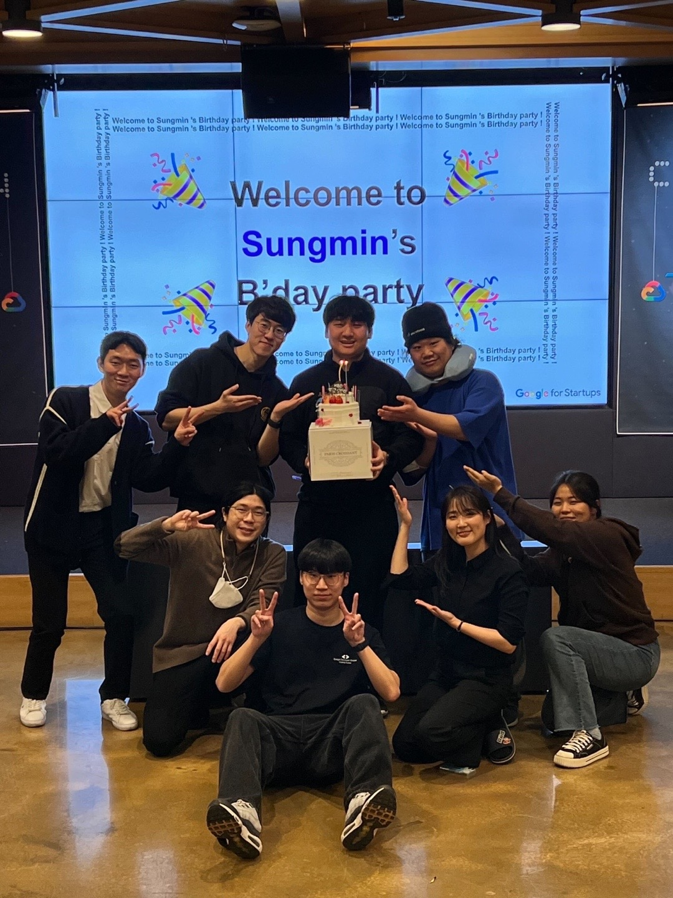
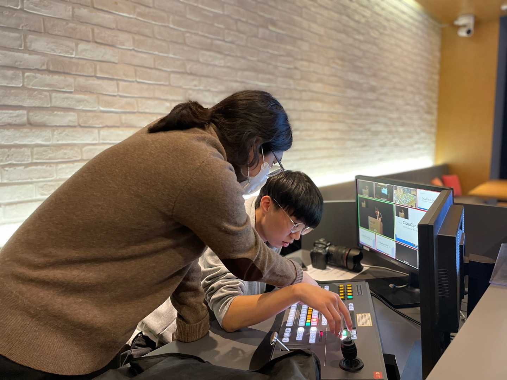

안녕하세요. 박현상입니다. 생각보다 다양한 일과 경험들을 2023년 1분기에 할 수 있었습니다.  
4월이 많이 지나버렸지만 늦었지만 기록하기 위해서 작성해 보겠습니다.  

## 고등학교 졸업
드디어 생각보다 많이 짧은 고등학교 생활을 마무리하고 졸업을 하게 되었습니다.  
보다 다양한 경험을 고등학교에서 할 수 있었습니다. 제가 좋아하는 것들을 배울 수 있는 기회가 되었습니다.  

## 일본 여행
친형과 함께 도쿄로 4박 5일 자유 여행을 가게 되었습니다.  
다양한 것들을 먹고 경험들과 더불어서 많은 사진을 찍을 수 있어서 행복한 여행이었습니다 :)

## GDG Golang Korea 활동
### 새롭게 합류!

온라인 커피챗 이후로 GDG(Google Developers Group) Golang Korea에 커뮤니티 운영자로써 합류하게 되었습니다. 한국과 해외에서 Go언어를 사용하시는 분들을 보다 가까이서 만날 수 있는 기회가 되었고, Go언어의 커뮤니티를 확장하고자 노력하고  있습니다.   
앞으로 Golang Korea가 재밌는 행사를 많이 개최하고자 노력하고 있어요! 많은 관심 부탁 드립니다.  

### KR Dev Community Workshop in Google Korea Office
GDG 운영진, GDE · WTM 앰배서더, 22-23 GDSC 리드들을 한 자리에서 만날 수 있는 자리를 구글에서 기획해 주셨습니다!  
처음으로 구글 코리아 오피스에 방문할 수 있었으며, 다양한 분들을 만나뵙고 이야기를 나눌 수 있어서 좋았습니다.  
맛있는 음식들도 왕창 먹을 수 있어서 행복하고 재밌었습니다!  
기획해 주신 Google(Korea)의 DevRel팀 감사합니다!

### Cloud in Go
GDG Cloud Korea와 GDG Golang Korea가 함께 진행한 행사입니다.  
다양한 주제로 발표를 해주신 발표자 분들께 감사 인사 드립니다.  
함께 행사를 기획하고 준비한 GDG Cloud Korea · GDG Golnag Korea Organizer 분들께도 감사 인사를 드립니다!  
행사를 하면서 많은 분들을 만나뵐 수 있어서 앞으로의 원동력이 생기게 된 계기가 되었습니다.

### 앞으로 Golang Korea에서는!
앞으로 GDG Golang Korea는 다양한 행사를 개최하고자 합니다.  
처음으로 한국에서 GopherCon KR을 개최하고자 합니다. 그 외에도 GDG 송도, GDG 부산 분들과 함께 다양한 행사를 개최하고자 노력하고 있으니 많은 관심과 참여 부탁드립니다!

## 읽고 있는 책 - 너의 말이 좋아서 밑줄을 그었다
림태주 시인의 책인 '너의 말이 좋아서 밑줄을 그었다'를 읽으면서 감명을 받는 부분들이 많아서 기록하고 있습니다. 누군가에게 인상 깊게 남는 글을 쓰는 방법이 많이 궁금해서 글쓰기를 잘하는 방법에 대해서도 생각을 많이 하고 있습니다.

> **나는 미워하는 시간보다 사랑하는 시간을, 잊으려 하는 시간보다 그 리워하는 시간을 더 늘리려고 한다. 나를 위한 유익과 즐거움을 구매하 는 데 내 목숨을 지불하려고 한다. 나는 자주 나에게 타이른다. 모두에 게 인정받고 인기를 얻으려고 목숨을 분산하지 마라. 정말 소중한 사람에게, 내 진심을 알아주는 사람에게 목숨을 내주어라. 그렇게 진실해지고 깊어지기를 원해라. 그래야 목숨이 흩어지지 않고 집약되고 축적된다. 그 집약과 축적의 관계를 사람들은 막역한 사이라거나 베스트 프렌드라거나 단짝이라거나 삼충사 등과 같은 말로 부른다.**  
> **정말은 정말일 때만 쓸 수 있다. 정말은 진심일 때만 쓸 수 있다. 정 말 사랑한다면 그에게 일 순위로 시간을 내주어야 한다. 그를 사랑하기 위해서는 분산되지 않는 목숨의 몰입이 있어야 한다. 다른 어떤 것보다 우선해서 그에게 시간을 쓰고 있다면 그가 알아주든 몰라주든 나의 진 심을 의심할 필요가 없다. 그 마음만큼 진짜가 없고, 그 시간만큼 정말 인 것은 없다. 시간이 진심이다.**

> **사람은 말로 사랑을 시작하고, 말로 서약하고, 말을 전할 아이를 낳고, 말의 세계로 아이를 내보낸다. 아이는 부모의 말을 전승해 자신의 말을 만들고 그 말을 지키며 산다. 말의 주인이 죽은 뒤에도 말은 살아서 누군가의 마음을 흔들고 삶의 방향이 된다. 얼마나 유장하고 위대한 생명 제인가, 당신과 나의 말들은.**

## 요즘 근황
- **회사에서:** 회사에서 요즘 Bazel(Gazelle), Skaffold(Kubernetes), GitHub Action을 이용해서 AWS EC2 인스턴스에 있는 Kubernetes로 배포하는 파이프라인을 구축하고 있습니다. 다음주에 새로운 오피스로 회사가 이전하면서 보다 좋은 환경에서 일을 할 수 있게 되었습니다.
- **학교에서:** 중간고사 기간인지라 생각보다 할 일이 많다는 것을 알게 되었습니다. 중간고사 대체 과제물이 많아서 열심히 하고 있으며, 시험 공부를 하고 있는데 재수강만 안 하게 잘하고 있습니다...ㅠ
- **개인적으로:**  요즘 클래식(피아노) 음악을 너무 좋아해서 히사이시 조, 엔니오 모리꼬네, 류이치 사카모토, 이루마 등 다양한 클래식(피아노) 음악들을 들으면서 공부랑 작업을 하고 있습니다. 복잡한 머리 속을 쉴 수 있는 음악인 듯 합니다.
    - [Yiruma(이루마) - I](https://youtu.be/4FGOyIljisk)
    - [Ennio Morricone - MALENA](https://youtu.be/9OKKMbb07Hw)
    - [Ryuichi Sakamoto - Blu](https://youtu.be/pWI5aVKvkCg)