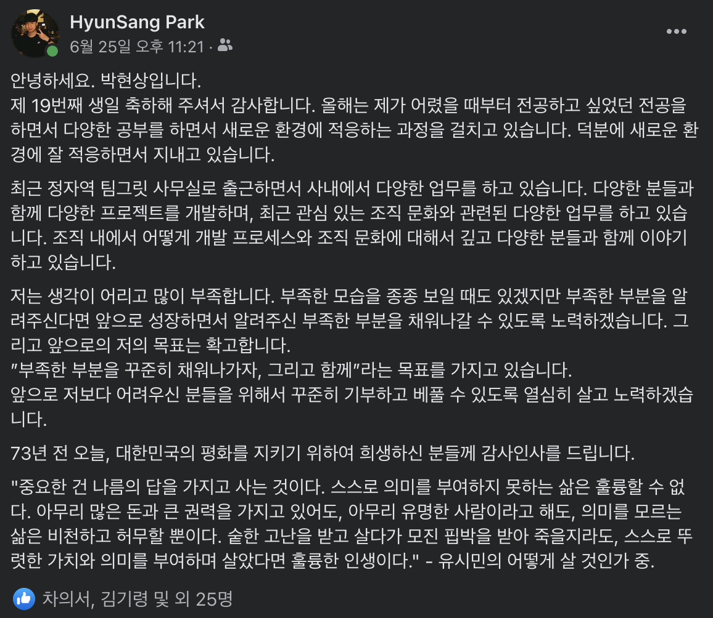
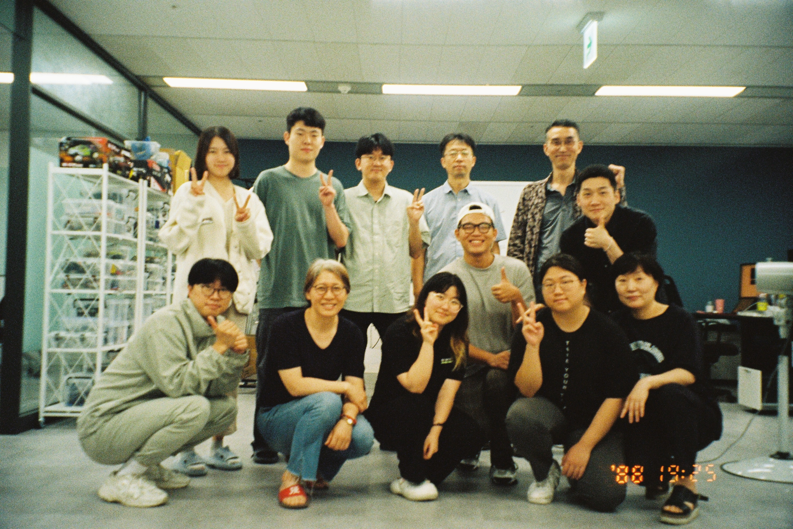
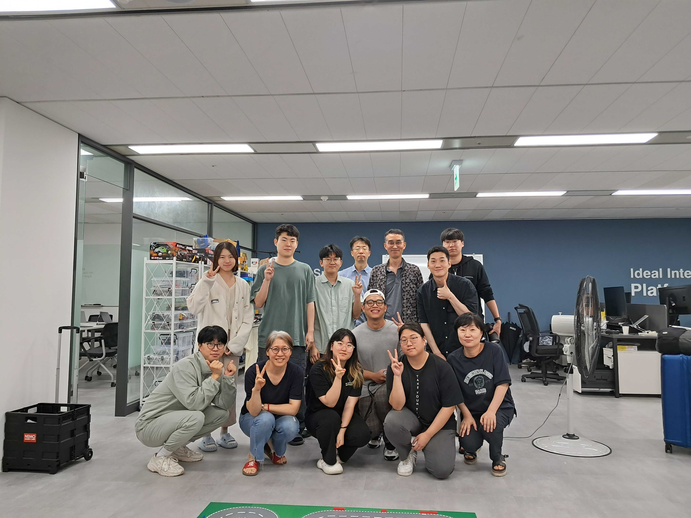
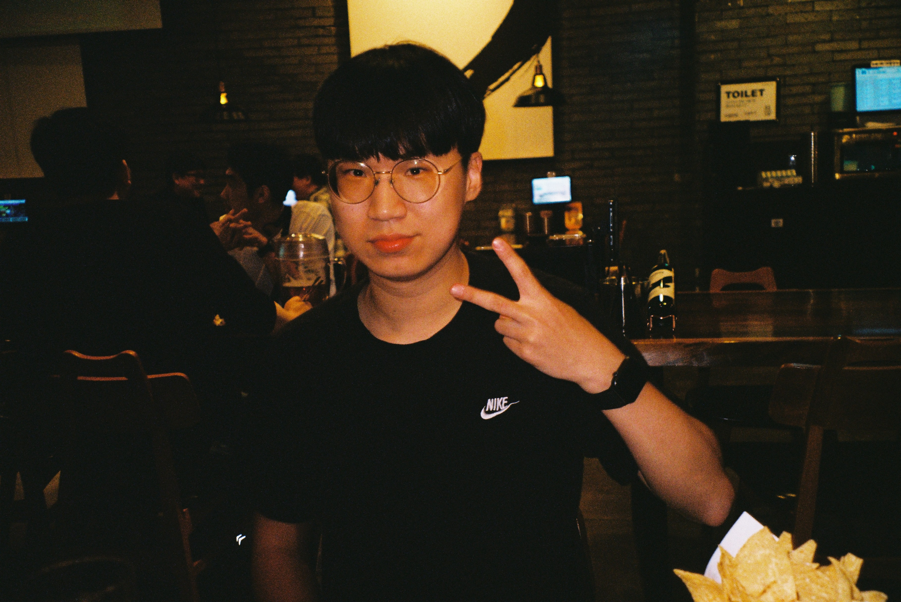
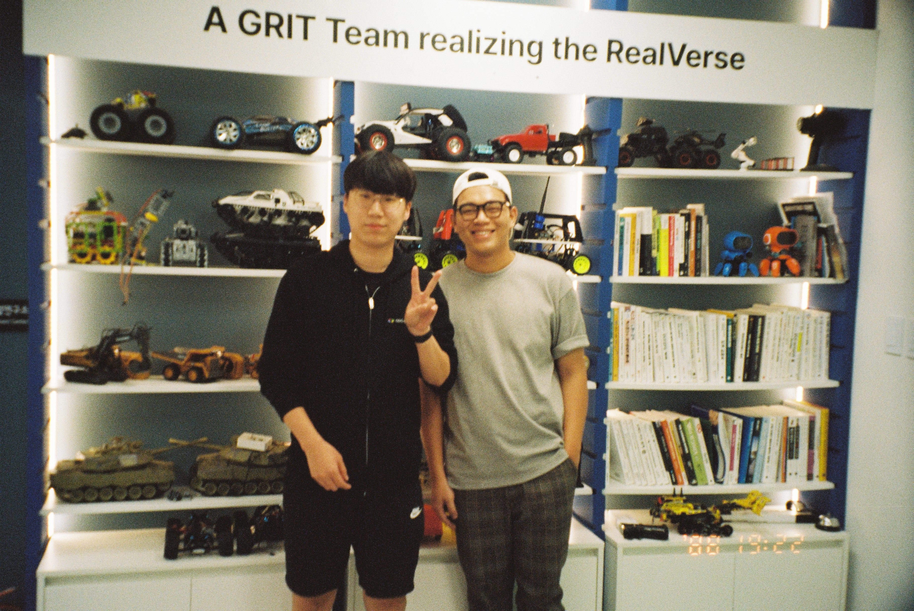

안녕하세요. 박현상입니다.  
시간이 생각보다 빠르게 지나서 2023년 2분기가 순식간에 지나가서 당황스럽지만 항상 행복하게 잘 살고 있어요 :)
저는 요즘에는 서울에서 다양한 분들을 만나뵙고 행복합니다!

## Table of Content:
- [2023학년도 1학기 종강](#2023학년도-1학기-종강)
- [만 19번째 생일 🥳](#만-19번째-생일-🥳)
- [사무실 출근!](#사무실-출근)
    - [베트남 사업부분 태성님과 함께!](#베트남-사업부분-태성님과-함께)
- [서울 근교에서 지내면서 느낀 점](#서울-근교에서-지내면서-느낀-점)
- [앞으로는!](#앞으로는)

## 2023학년도 1학기 종강
제가 어렸을 때부터 원하던 전공인 "정보보호학"을 전공할 수 있어서 항상 감사하고 있습니다.  
1학기 동안 어떻게 공부해야할지 감을 찾고 있어서 학점이 좋지 않아서 부모님께 죄송하지만...🥲  
그래도 교수님께서 학점을 잘 주신 듯 하셔서 감사합니다...ㅎㅎ 2학기 때는 지금보다 열심히 공부하겠습니다.  
동기들과 함께 봄이 찾아오던 날, 잔디밭에서 술을 마신 기억이 가장 인상 깊네요...!!!  

## 만 19번째 생일 🥳
많은 분들께서 제 만 19번째 생일을 축하해 주셔서 감사합니다.  
행복한 하루를 보낼 수 있었고, 앞으로도 항상 긍정적이고 행복하게 지내겠습니다 :)

## 사무실 출근!
종강 이후 바로 정자역 킨스타워의 팀그릿 사무실로 출근하게 되었습니다.  
요즘에는 사내에서 다양한 논의가 있었던 조직문화에 대해서 더 깊숙하게 관여하고 문제점들을 해결하고 사내에서 건실한 조직문화를 만들어가고자 노력하고 있습니다.  
건실한 조직문화를 만드는 노력과 더불어서 기존의 프로젝트를 이어받아서 백엔드 부분을 개발하고 있습니다.  

### 베트남 사업부분 태성님과 함께!
태성님과 함께 3주 정도 함께 저녁식사를 먹고, 서울 탐방을 하게 되었습니다.  
태성님은 회사에서 베트남 사업 부분을 담당하고 현지에서 담당하고 계십니다.  
제가 영어가 많이 짧아서 원할한 소통이 되지는 못 하였지만 영어로 소통하는 방법에 대해서 조금씩 알게 되었고 제가 모르는 영어 단어가 있으면 찾아보고 이야기 드리면 불편하지만 영어 커뮤니케이션 능력이 늘어나고 있는 듯 합니다 ㅎㅎ  
(참고로 태성님은 베트남 분이시고, 한국명이 태성님이십니다!)

태성님이 베트남으로 가시기 전에 미팅하시고 계신 분들께서 급하게 나와서 남긴 단체사진!

그리고 필름 사진을 좋아하는 태성님께서 처음으로 함께 만난 날! 치킨을 먹고 싶다고 하셔서 치킨을 먹으면서 제 모습을 사진을 찍어주셨는데! 마음에 아주 쏙 들어서 SNS 프로필 사진과 회사 메신저 프로필 사진도 바꾸었다는 사실...ㅎㅎ

태성님이 베트남으로 가시기 전에 사무실에서 찍은 사진...!!

## 서울 근교에서 지내면서 느낀 점
저는 읽고 싶은 책이 있으면 항상 온라인 서점 장바구니에 넣어두곤 해요! 그 중에서 몇 권은 '진짜 읽으면 좋겠다'라는 생각이 들면 사서 보곤 해요.  
택배가 빠르게 오지만 줄거리를 읽고 살 수 없다는 점이 항상 불편하기도 하였는데 서울 근교에 있으면 큰 서점(교보문구, 영풍문고 등)에서 책의 내용을 읽어보고 살 수 있어서 조금 더 선택의 폭이 넓어질 수 있는 느낌을 받고 있어요. 

그리고 다양한 분들을 만나뵙고, 커뮤니티 활동을 하고 있는 Golang Korea(+ 준비위원회) 분들을 자주 뵙고 인사 드릴 수 있어서 좋습니다!

## 앞으로는!
서울에서 있으면서 다양한 사진을 찍고 엽서로 만들어 볼 생각입니다...ㅎㅎ
8월에 열리는 GopherCon Korea 2023도 많은 관심과 참여 부탁드립니다! 준비위원회에서 많은 분들이 함께 준비하고 있어욧!!  
앞으로 빗소리가 들리는 7월, 빗소리를 들으면서 제가 좋아하는 인문학과 철학에 대한 책을 읽으면서 양식(良識)을 쌓아나가겠습니다 ㅎㅎ