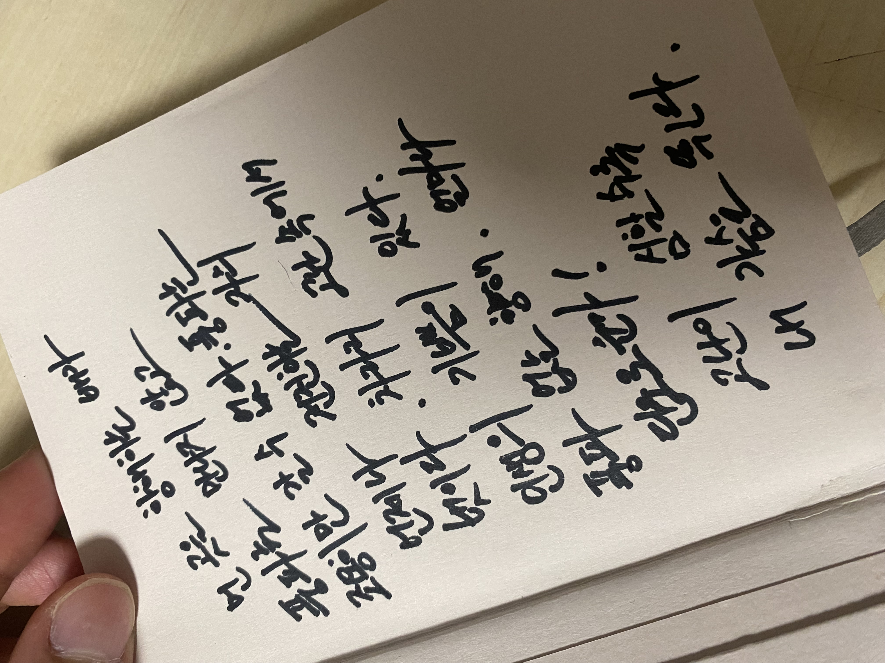

제가 앞으로 살면서 어떻게 살아가야할지에 대해서 저의 생각을 정리해 보고자 합니다.
저에게는 존경하는 인물들이 생각보다 많습니다. 존경한 사람들이 어떤 말을 하고 사는지, 그리고 어떻게 성공했는지에 대해서 보면서 어떻게 성공하고 생각했는지에 대해서 제 생각을 정리하고자 합니다.  

## Table of Content
- [존경하는 사람들.](#존경하는-사람들)
    - [철학자 프리드리히 니체](#철학자-프리드리히-니체)
    - [수학자 허준이](#수학자-허준이)
    - [문학가 이어령](#문학가-이어령)
    - [넥슨 창업주 김정주](#넥슨-창업주-김정주)
    - [팀그릿 강성일 대표](#팀그릿-강성일-대표)
- [앞으로 나의 행보는?](#앞으로-나의-행보는)

## 존경하는 사람들.
제가 존경하는 사람들이 생각보다 많습니다. 존경하는 사람들이 했던 말들과 그들의 말들과 함께 저만의 생각을 이야기 해 보고자 합니다.

### 철학자 프리드리히 니체
제가 많이 읽는 철학 서적 중의 90% 이상 니체가 쓴 책 혹은 니체와 관련된 책입니다.  
니체는 극기(克己)의 선지자이었습니다. 이런 극기의 선지자이었던 니체가 쓴 책을 읽으면서 저는 많은 영감을 얻었습니다. 니체가 했던 말 중에 제가 가장 기억에 남는 글(명언)들이 있습니다.

> **"먼곳을 향해하는 배가 풍파를 만나지 않고 조용히만 갈 수 없다.  
> 풍파는 언제나 전진하는 자의 벗이다. 차라리 고난 속에 인생의 기쁨이 있다.  
> 풍파 없는 항해. 얼마나 단로운가! 고난이 심할수록 내 가슴은 뛴다."**

가장 인상 깊은 명언인지라 캘린더 제일 앞 장에 기록해 두었다.
  

> **”모든 것의 시작은 위험하다. 그러나 무엇을 막론하고,  
> 시작하지 않으면 아무것도 시작되지 않는다.“**

### 수학자 허준이
필즈상을 수상하면서 엄청난 인기를 얻은 수학자 허준이의 서울대학교 졸업식 축사를 보면서 많은 영감을 받았습니다.  

> **"실패를 두려워하지 말고 도전하라. 편안하고 안전한 길을 거부하라."**

<iframe width="560" height="315" src="https://www.youtube.com/embed/OLDhaqosPtA" title="YouTube video player" frameborder="0" allow="accelerometer; autoplay; clipboard-write; encrypted-media; gyroscope; picture-in-picture; web-share" allowfullscreen></iframe>

### 문학가 이어령
이어령 선생님의 영상을 예전에 보았지만 관심이 별로 없었지만 인문학에 대해서 관심을 가진 이후로 [이어령의 마지막 수업](http://www.yes24.com/Product/Goods/104692009)을 읽으면서 제가 영감을 받는 부분이 많았습니다.  
저는 성격이 굉장히 계획적인 성격인지라, '항상 시작은 어떻게 하고 마무리는 어떻게 해야할까?'라는 생각과 함께 고민이 있습니다.  
그 중에서 마지막인 "죽음"에 대해서 생각하던 도중 이어령의 마지막 수업을 읽게 되었고 책 속에서 정답은 아니만 조금의 해법을 알게 되었습니다.  

> ***"내가 느끼는 죽음은 마른 대지를 적시는 소낙비나  
> 조용히 떨어지는 단풍잎이에요.  
> 겨울이 오고 있구나.  
> 그러나 내가 받았던 빛나는 선물을 나는 돌려주려고 해요."*** 

이어령 선생님께서 하신 말을 아니지만 비슷한 성경 구절을 좋아합니다.

> **28강. 흙으로 돌아가라 (창 3:17-19)**   
> ***창 3:17-19절. “아담에게 이르시되 네가 네 아내의 말을 듣고 내가 너더러 먹지 말라한 나무 실과를 먹었은즉 땅은 너로 인하여 저주를 받고 너는 종신토록 수고하여야 그 소산을 먹으리라 18. 땅이 네게 가시덤불과 엉겅퀴를 낼 것이라 너의 먹을 것은 밭의 채소인즉 19. 네가 얼굴에 땀이 흘러야 식물을 먹고 필경은 흙으로 돌아가리니 그 속에서 네가 취함을 입었음이라 너는 흙이니 흙으로 돌아갈 것이니라 하시니라”***

<iframe width="560" height="315" src="https://www.youtube.com/embed/9X5-X-qvMlE" title="YouTube video player" frameborder="0" allow="accelerometer; autoplay; clipboard-write; encrypted-media; gyroscope; picture-in-picture; web-share" allowfullscreen></iframe>

<iframe width="560" height="315" src="https://www.youtube.com/embed/Q2BHEQpZAMs" title="YouTube video player" frameborder="0" allow="accelerometer; autoplay; clipboard-write; encrypted-media; gyroscope; picture-in-picture; web-share" allowfullscreen></iframe>

### 넥슨 창업주 김정주
고인이 되신 김정주 대표님의 행보를 보면서 많은 점을 배웠습니다. 6천만원에서 시작한 넥슨을 시가총액 24조원, 연매출 3조의 세계적인 게임사로 성장 시키셨습니다.  
넥슨 재단을 통해서 어린이재활병원을 건립하는 모습을 보고, 다른 큰 대기업도 많은 선행을 펼치지만 넥슨이 어린이재활병원에 관심을 가지고 지속적으로 기부하는 모습을 보고서 존경하게 되었습니다.   

<iframe width="560" height="315" src="https://www.youtube.com/embed/hZ4x-FdcjzE" title="YouTube video player" frameborder="0" allow="accelerometer; autoplay; clipboard-write; encrypted-media; gyroscope; picture-in-picture; web-share" allowfullscreen></iframe>

<iframe width="560" height="315" src="https://www.youtube.com/embed/HMOyG6cw8EU" title="YouTube video player" frameborder="0" allow="accelerometer; autoplay; clipboard-write; encrypted-media; gyroscope; picture-in-picture; web-share" allowfullscreen></iframe>

### 팀그릿 강성일 대표
제가 지금 재직하고 있는 회사의 대표님이신 강성일 대표님은 제게 가장 큰 영감과 많은 조언 속에서 한 층 한 층 성장할 수 있었습니다.  
대표님께서는 "남이 가지 않는 길을 걸어보는 것도 나쁘지 않다.", "남이 시도한 것들을 시도하지 말고 새로운 것들을 시도 해 봐라."라고 항상 말하시고 제게 앞으로 개발자를 하기 위해서 어떻게 해야하는지 등 다양한 생각을 제게 영감을 주시고 있습니다. 항상 존경하고 새로운 시도와 공부를 하시는 모습을 보고 크게 감탄하고 항상 많은 것들을 배우고 있습니다.대표님, 항상 감사합니다 :)

## 앞으로 나의 행보는?
저는 앞으로 제가 말씀한 사람들의 완전히 따라가지 않을 겁니다. 저는 저만의 길을 걷고 싶습니다.  
어렸을 때부터 제가 하고 싶은 일들을 하면서 살았고, 공부는 뒤전이었습니다. 고등학교 때에는 열심히 공부를 하지 않았지만 중간 정도의 성적을 유지하고 졸업하고 다행히도 원하던 대학교에 올 수 있었습니다. 제가 하고 싶은 일이 생기면 구체적으로 생각하고 계획해서 그것을 실천하는 것을 좋아합니다. 앞으로 저만의 계획을 세우면서 다른 사람들이 하는 이야기와 기술과 관련된 토픽들을 잘 팔로잉하면서 저만의 길을 걸어가고 싶습니다.  

때로는 성숙하지 않아서 실수도 하고 넘어지기도 하겠지만, 실수와 넘어짐의 연속에서 다시 일어나서 하고자 하는 것을 이루면서 사는 것이 제 인생에 있어서 목표입니다.  
또한 다양한 분들과 함께 일하고, 이야기를 나누면서 성장하고자 노력하겠습니다 :)