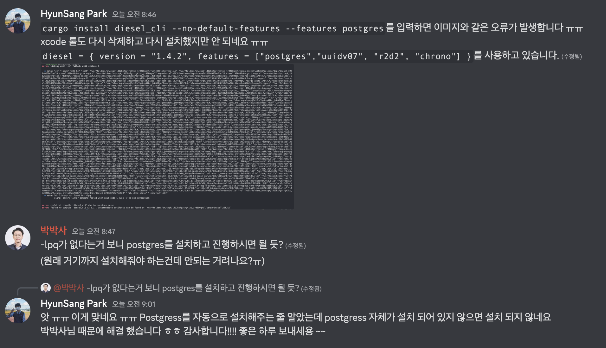

본 게시물에서는 제가 Rust를 공부하면서 다양한 오류를 기록하고 오류 해결 방법에 대해서 기록합니다.  

## `error: linking with cc failed: exit status 1`
```shell
$ cargo install diesel_cli --no-default-features --features postgres
    Updating crates.io index
  Installing diesel_cli v2.0.1
   Compiling proc-macro2 v1.0.47
   Compiling unicode-ident v1.0.5
   Compiling quote v1.0.21
   Compiling syn v1.0.105
   Compiling autocfg v1.1.0
   Compiling serde v1.0.149
   Compiling serde_derive v1.0.149
   Compiling version_check v0.9.4
   Compiling libc v0.2.138
   Compiling memchr v2.5.0
   Compiling core-foundation-sys v0.8.3
   Compiling bitflags v1.3.2
   Compiling pq-sys v0.4.7
   Compiling tinyvec_macros v0.1.0
   Compiling os_str_bytes v6.4.1
   Compiling hashbrown v0.12.3
   Compiling percent-encoding v2.2.0
   Compiling tinyvec v1.6.0
   Compiling overload v0.1.1
   Compiling itoa v1.0.4
   Compiling unicode-bidi v0.3.8
   Compiling clap_lex v0.2.4
   Compiling proc-macro-error-attr v1.0.4
   Compiling proc-macro-error v1.0.4
   Compiling num-traits v0.2.15
   Compiling indexmap v1.9.2
   Compiling num-integer v0.1.45
   Compiling unicode-normalization v0.1.22
   Compiling strsim v0.10.0
   Compiling regex-syntax v0.6.28
   Compiling textwrap v0.16.0
   Compiling byteorder v1.4.3
   Compiling termcolor v1.1.3
   Compiling idna v0.3.0
   Compiling aho-corasick v0.7.20
   Compiling form_urlencoded v1.1.0
   Compiling iana-time-zone v0.1.53
   Compiling nu-ansi-term v0.46.0
   Compiling heck v0.4.0
   Compiling dotenvy v0.15.6
   Compiling atty v0.2.14
   Compiling url v2.3.1
   Compiling diffy v0.3.0
   Compiling clap v3.2.23
   Compiling regex v1.7.0
   Compiling chrono v0.4.23
   Compiling clap_complete v3.2.5
   Compiling diesel_derives v2.0.1
   Compiling diesel v2.0.2
   Compiling toml v0.5.9
   Compiling serde_regex v1.1.0
   Compiling migrations_internals v2.0.0
   Compiling migrations_macros v2.0.0
   Compiling diesel_migrations v2.0.0
   Compiling diesel_cli v2.0.1
error: linking with `cc` failed: exit status: 1
  |
  = note: "cc" "-arch" "x86_64" "-m64" "/var/folders/pn/cxqkjl412hx7gztrg41kc_jr0000gn/T/rustcQEP129/symbols.o" "/var/folders/pn/cxqkjl412hx7gztrg41kc_jr0000gn/T/cargo-installZb1ySO/release/deps/diesel-2239d0258e7baf20.diesel.480443c6-cgu.0.rcgu.o" "/var/folders/pn/cxqkjl412hx7gztrg41kc_jr0000gn/T/cargo-installZb1ySO/release/deps/diesel-2239d0258e7baf20.diesel.480443c6-cgu.1.rcgu.o" "/var/folders/pn/cxqkjl412hx7gztrg41kc_jr0000gn/T/cargo-installZb1ySO/release/deps/diesel-2239d0258e7baf20.diesel.480443c6-cgu.10.rcgu.o" "/var/folders/pn/cxqkjl412hx7gztrg41kc_jr0000gn/T/cargo-installZb1ySO/release/deps/diesel-2239d0258e7baf20.diesel.480443c6-cgu.11.rcgu.o" "/var/folders/pn/cxqkjl412hx7gztrg41kc_jr0000gn/T/cargo-installZb1ySO/release/deps/diesel-2239d0258e7baf20.diesel.480443c6-cgu.12.rcgu.o" "/var/folders/pn/cxqkjl412hx7gztrg41kc_jr0000gn/T/cargo-installZb1ySO/release/deps/diesel-2239d0258e7baf20.diesel.480443c6-cgu.13.rcgu.o" "/var/folders/pn/cxqkjl412hx7gztrg41kc_jr0000gn/T/cargo-installZb1ySO/release/deps/diesel-2239d0258e7baf20.diesel.480443c6-cgu.14.rcgu.o" "/var/folders/pn/cxqkjl412hx7gztrg41kc_jr0000gn/T/cargo-installZb1ySO/release/deps/diesel-2239d0258e7baf20.diesel.480443c6-cgu.15.rcgu.o" "/var/folders/pn/cxqkjl412hx7gztrg41kc_jr0000gn/T/cargo-installZb1ySO/release/deps/diesel-2239d0258e7baf20.diesel.480443c6-cgu.2.rcgu.o" "/var/folders/pn/cxqkjl412hx7gztrg41kc_jr0000gn/T/cargo-installZb1ySO/release/deps/diesel-2239d0258e7baf20.diesel.480443c6-cgu.3.rcgu.o" "/var/folders/pn/cxqkjl412hx7gztrg41kc_jr0000gn/T/cargo-installZb1ySO/release/deps/diesel-2239d0258e7baf20.diesel.480443c6-cgu.4.rcgu.o" "/var/folders/pn/cxqkjl412hx7gztrg41kc_jr0000gn/T/cargo-installZb1ySO/release/deps/diesel-2239d0258e7baf20.diesel.480443c6-cgu.5.rcgu.o" "/var/folders/pn/cxqkjl412hx7gztrg41kc_jr0000gn/T/cargo-installZb1ySO/release/deps/diesel-2239d0258e7baf20.diesel.480443c6-cgu.6.rcgu.o" "/var/folders/pn/cxqkjl412hx7gztrg41kc_jr0000gn/T/cargo-installZb1ySO/release/deps/diesel-2239d0258e7baf20.diesel.480443c6-cgu.7.rcgu.o" "/var/folders/pn/cxqkjl412hx7gztrg41kc_jr0000gn/T/cargo-installZb1ySO/release/deps/diesel-2239d0258e7baf20.diesel.480443c6-cgu.8.rcgu.o" "/var/folders/pn/cxqkjl412hx7gztrg41kc_jr0000gn/T/cargo-installZb1ySO/release/deps/diesel-2239d0258e7baf20.diesel.480443c6-cgu.9.rcgu.o" "/var/folders/pn/cxqkjl412hx7gztrg41kc_jr0000gn/T/cargo-installZb1ySO/release/deps/diesel-2239d0258e7baf20.osyifqfmqijbdd2.rcgu.o" "-L" "/var/folders/pn/cxqkjl412hx7gztrg41kc_jr0000gn/T/cargo-installZb1ySO/release/deps" "-L" "/usr/local/Cellar/rust/1.65.0/lib/rustlib/x86_64-apple-darwin/lib" "/private/var/folders/pn/cxqkjl412hx7gztrg41kc_jr0000gn/T/cargo-installZb1ySO/release/deps/libdiffy-feb686537b438f90.rlib" "/private/var/folders/pn/cxqkjl412hx7gztrg41kc_jr0000gn/T/cargo-installZb1ySO/release/deps/libnu_ansi_term-f74bc2cae31b91ac.rlib" "/private/var/folders/pn/cxqkjl412hx7gztrg41kc_jr0000gn/T/cargo-installZb1ySO/release/deps/liboverload-7f6962cb4b7800ad.rlib" "/private/var/folders/pn/cxqkjl412hx7gztrg41kc_jr0000gn/T/cargo-installZb1ySO/release/deps/liburl-19a908c6fbc8fd14.rlib" "/private/var/folders/pn/cxqkjl412hx7gztrg41kc_jr0000gn/T/cargo-installZb1ySO/release/deps/libidna-7a1f260ab1b75bb2.rlib" "/private/var/folders/pn/cxqkjl412hx7gztrg41kc_jr0000gn/T/cargo-installZb1ySO/release/deps/libunicode_normalization-c73b01e29af39fc4.rlib" "/private/var/folders/pn/cxqkjl412hx7gztrg41kc_jr0000gn/T/cargo-installZb1ySO/release/deps/libtinyvec-af6c0e25e69787b7.rlib" "/private/var/folders/pn/cxqkjl412hx7gztrg41kc_jr0000gn/T/cargo-installZb1ySO/release/deps/libtinyvec_macros-37c2c358d67f30d7.rlib" "/private/var/folders/pn/cxqkjl412hx7gztrg41kc_jr0000gn/T/cargo-installZb1ySO/release/deps/libunicode_bidi-40fbbf2918c302af.rlib" "/private/var/folders/pn/cxqkjl412hx7gztrg41kc_jr0000gn/T/cargo-installZb1ySO/release/deps/libform_urlencoded-5f4dba9f52310a29.rlib" "/private/var/folders/pn/cxqkjl412hx7gztrg41kc_jr0000gn/T/cargo-installZb1ySO/release/deps/libpercent_encoding-5afb5c2b817fe057.rlib" "/private/var/folders/pn/cxqkjl412hx7gztrg41kc_jr0000gn/T/cargo-installZb1ySO/release/deps/libdotenvy-97b4442a42df4d1f.rlib" "/private/var/folders/pn/cxqkjl412hx7gztrg41kc_jr0000gn/T/cargo-installZb1ySO/release/deps/libchrono-63ff5a300c6f24e8.rlib" "/private/var/folders/pn/cxqkjl412hx7gztrg41kc_jr0000gn/T/cargo-installZb1ySO/release/deps/libiana_time_zone-fb15530a0064981f.rlib" "/private/var/folders/pn/cxqkjl412hx7gztrg41kc_jr0000gn/T/cargo-installZb1ySO/release/deps/libcore_foundation_sys-7ea2712e9dbf86df.rlib" "/private/var/folders/pn/cxqkjl412hx7gztrg41kc_jr0000gn/T/cargo-installZb1ySO/release/deps/libnum_integer-b420368cbdeff91a.rlib" "/private/var/folders/pn/cxqkjl412hx7gztrg41kc_jr0000gn/T/cargo-installZb1ySO/release/deps/libnum_traits-1ce5976b91856d9c.rlib" "/private/var/folders/pn/cxqkjl412hx7gztrg41kc_jr0000gn/T/cargo-installZb1ySO/release/deps/libserde_regex-a0753353ad59f5f3.rlib" "/private/var/folders/pn/cxqkjl412hx7gztrg41kc_jr0000gn/T/cargo-installZb1ySO/release/deps/libregex-da7ec6fdaa0258a5.rlib" "/private/var/folders/pn/cxqkjl412hx7gztrg41kc_jr0000gn/T/cargo-installZb1ySO/release/deps/libaho_corasick-b379d46d5fede9f8.rlib" "/private/var/folders/pn/cxqkjl412hx7gztrg41kc_jr0000gn/T/cargo-installZb1ySO/release/deps/libmemchr-c3b4583b4e4f5328.rlib" "/private/var/folders/pn/cxqkjl412hx7gztrg41kc_jr0000gn/T/cargo-installZb1ySO/release/deps/libregex_syntax-9c95497e10cc741c.rlib" "/private/var/folders/pn/cxqkjl412hx7gztrg41kc_jr0000gn/T/cargo-installZb1ySO/release/deps/libheck-03b7bff160cac4e0.rlib" "/private/var/folders/pn/cxqkjl412hx7gztrg41kc_jr0000gn/T/cargo-installZb1ySO/release/deps/libclap_complete-a5ce2a6501ceda46.rlib" "/private/var/folders/pn/cxqkjl412hx7gztrg41kc_jr0000gn/T/cargo-installZb1ySO/release/deps/libdiesel_migrations-3a884e86bab1e6a4.rlib" "/private/var/folders/pn/cxqkjl412hx7gztrg41kc_jr0000gn/T/cargo-installZb1ySO/release/deps/libmigrations_internals-ac23e3ef67b67a6d.rlib" "/private/var/folders/pn/cxqkjl412hx7gztrg41kc_jr0000gn/T/cargo-installZb1ySO/release/deps/libtoml-bf33cb2ab37e1388.rlib" "/private/var/folders/pn/cxqkjl412hx7gztrg41kc_jr0000gn/T/cargo-installZb1ySO/release/deps/libdiesel-ce44bd1ae68f9a2e.rlib" "/private/var/folders/pn/cxqkjl412hx7gztrg41kc_jr0000gn/T/cargo-installZb1ySO/release/deps/libitoa-0349435020d4ed83.rlib" "/private/var/folders/pn/cxqkjl412hx7gztrg41kc_jr0000gn/T/cargo-installZb1ySO/release/deps/libbyteorder-802bfcbcf964bcb4.rlib" "/private/var/folders/pn/cxqkjl412hx7gztrg41kc_jr0000gn/T/cargo-installZb1ySO/release/deps/libpq_sys-84c3b871630f41bb.rlib" "/private/var/folders/pn/cxqkjl412hx7gztrg41kc_jr0000gn/T/cargo-installZb1ySO/release/deps/libclap-98c42516b1f4ad73.rlib" "/private/var/folders/pn/cxqkjl412hx7gztrg41kc_jr0000gn/T/cargo-installZb1ySO/release/deps/libatty-ab585f2378d13500.rlib" "/private/var/folders/pn/cxqkjl412hx7gztrg41kc_jr0000gn/T/cargo-installZb1ySO/release/deps/liblibc-bcd0d23c654abc71.rlib" "/private/var/folders/pn/cxqkjl412hx7gztrg41kc_jr0000gn/T/cargo-installZb1ySO/release/deps/libstrsim-b7418aae77f9e588.rlib" "/private/var/folders/pn/cxqkjl412hx7gztrg41kc_jr0000gn/T/cargo-installZb1ySO/release/deps/libtermcolor-4fa4f55d0a0f00f8.rlib" "/private/var/folders/pn/cxqkjl412hx7gztrg41kc_jr0000gn/T/cargo-installZb1ySO/release/deps/libtextwrap-b2adb803bfb32e09.rlib" "/private/var/folders/pn/cxqkjl412hx7gztrg41kc_jr0000gn/T/cargo-installZb1ySO/release/deps/libclap_lex-61b1bf896becb1c3.rlib" "/private/var/folders/pn/cxqkjl412hx7gztrg41kc_jr0000gn/T/cargo-installZb1ySO/release/deps/libos_str_bytes-5a6018787520e205.rlib" "/private/var/folders/pn/cxqkjl412hx7gztrg41kc_jr0000gn/T/cargo-installZb1ySO/release/deps/libindexmap-57367f7020eef4ef.rlib" "/private/var/folders/pn/cxqkjl412hx7gztrg41kc_jr0000gn/T/cargo-installZb1ySO/release/deps/libhashbrown-831e13c2573370f0.rlib" "/private/var/folders/pn/cxqkjl412hx7gztrg41kc_jr0000gn/T/cargo-installZb1ySO/release/deps/libbitflags-6ecef0dae46827bd.rlib" "/private/var/folders/pn/cxqkjl412hx7gztrg41kc_jr0000gn/T/cargo-installZb1ySO/release/deps/libserde-a421364d321d833f.rlib" "/usr/local/Cellar/rust/1.65.0/lib/rustlib/x86_64-apple-darwin/lib/libstd-bc8ff4ffc651cdd0.rlib" "/usr/local/Cellar/rust/1.65.0/lib/rustlib/x86_64-apple-darwin/lib/libpanic_unwind-7a2d63bd4dfde9f5.rlib" "/usr/local/Cellar/rust/1.65.0/lib/rustlib/x86_64-apple-darwin/lib/libobject-c4cbfc4de5d62b44.rlib" "/usr/local/Cellar/rust/1.65.0/lib/rustlib/x86_64-apple-darwin/lib/libmemchr-273e901569ea2b89.rlib" "/usr/local/Cellar/rust/1.65.0/lib/rustlib/x86_64-apple-darwin/lib/libaddr2line-9e1a922f947faa3e.rlib" "/usr/local/Cellar/rust/1.65.0/lib/rustlib/x86_64-apple-darwin/lib/libgimli-d5dad5a620cd00b2.rlib" "/usr/local/Cellar/rust/1.65.0/lib/rustlib/x86_64-apple-darwin/lib/librustc_demangle-476428cc6e58bf63.rlib" "/usr/local/Cellar/rust/1.65.0/lib/rustlib/x86_64-apple-darwin/lib/libstd_detect-9056f50d5068726a.rlib" "/usr/local/Cellar/rust/1.65.0/lib/rustlib/x86_64-apple-darwin/lib/libhashbrown-9423c29ffb50e18d.rlib" "/usr/local/Cellar/rust/1.65.0/lib/rustlib/x86_64-apple-darwin/lib/libminiz_oxide-99327f53244a5bed.rlib" "/usr/local/Cellar/rust/1.65.0/lib/rustlib/x86_64-apple-darwin/lib/libadler-76c10a3397f72e07.rlib" "/usr/local/Cellar/rust/1.65.0/lib/rustlib/x86_64-apple-darwin/lib/librustc_std_workspace_alloc-be159387752937aa.rlib" "/usr/local/Cellar/rust/1.65.0/lib/rustlib/x86_64-apple-darwin/lib/libunwind-44b94b1ae9d72f63.rlib" "/usr/local/Cellar/rust/1.65.0/lib/rustlib/x86_64-apple-darwin/lib/libcfg_if-88d8fb851c129081.rlib" "/usr/local/Cellar/rust/1.65.0/lib/rustlib/x86_64-apple-darwin/lib/liblibc-7ec8672b2c885580.rlib" "/usr/local/Cellar/rust/1.65.0/lib/rustlib/x86_64-apple-darwin/lib/liballoc-b454c2b861412f9d.rlib" "/usr/local/Cellar/rust/1.65.0/lib/rustlib/x86_64-apple-darwin/lib/librustc_std_workspace_core-d7c646667e888ac3.rlib" "/usr/local/Cellar/rust/1.65.0/lib/rustlib/x86_64-apple-darwin/lib/libcore-d6568ca71248fcbd.rlib" "/usr/local/Cellar/rust/1.65.0/lib/rustlib/x86_64-apple-darwin/lib/libcompiler_builtins-63b581045c174632.rlib" "-framework" "CoreFoundation" "-lpq" "-liconv" "-lSystem" "-lresolv" "-lc" "-lm" "-liconv" "-L" "/usr/local/Cellar/rust/1.65.0/lib/rustlib/x86_64-apple-darwin/lib" "-o" "/var/folders/pn/cxqkjl412hx7gztrg41kc_jr0000gn/T/cargo-installZb1ySO/release/deps/diesel-2239d0258e7baf20" "-Wl,-dead_strip" "-nodefaultlibs"
  = note: ld: library not found for -lpq
          clang: error: linker command failed with exit code 1 (use -v to see invocation)


error: could not compile `diesel_cli` due to previous error
error: failed to compile `diesel_cli v2.0.1`, intermediate artifacts can be found at `/var/folders/pn/cxqkjl412hx7gztrg41kc_jr0000gn/T/cargo-installZb1ySO`
```
### 해결 방법1
`error: linking with `cc` failed: exit status: 1`라는 오류 메시지가 표출 되는 것을 보게 되었습니다.  
`cc` 관련 오류로 인해서 `xcode-select`를 삭제 후 다시 설치하였습니다.

```shell
$ xcode-select --install
xcode-select: error: command line tools are already installed, use “Software Update” to install updates
$ sudo rm -rf /Library/Developer/CommandLineTools
$ sudo xcode-selete --install
```

**하지만 해결되지 않았습니다.** 해결 되지 않아서 커뮤니티에 도움을 요청 했습니다.

- [error-linking-with-cc-failed-exit-code-1](https://stackoverflow.com/questions/28124221/error-linking-with-cc-failed-exit-code-1)
- [Mac CommandLineTools 설치와 오류 해결 방법 – xcode-select: error: command line tools are already installed, use “Software Update” to install updates](https://investechnews.com/2021/06/15/mac-commandlinetools-setup-error/)

## 해결 방법2
제가 코드를 만들면서 큰 실수 하나를 했습니다. postgres를 설치하지 않고 관련 패키지를 설치하려고 했습니다.  
제가 자주 보고 도움을 받는 코딩맛집 커뮤니티에 제 상황을 올리게 되었습니다.



```shell
= note: ld: library not found for -lpq
        clang: error: linker command failed with exit code 1 (use -v to see invocation)
```
`lpq`는 postgres 라이브러리 중 하나라는 사실를 알게 되었으며, postgres 설치를 하지 않아서 벌어지는 오류라는 사실을 알게 되었습니다.  
**postgres를 설치해서 해결 하였습니다.** 오류 해결에 도움을 주신 박박사님 감사합니다 :)  
다음부터는 오류 발생 시 메시지를 꼼꼼히 읽고 해결해 보겠습니다...!

```shell
$ brew install postgres
```

- [/usr/bin/ld: cannot find -lpq](https://askubuntu.com/questions/1148609/usr-bin-ld-cannot-find-lpq)
